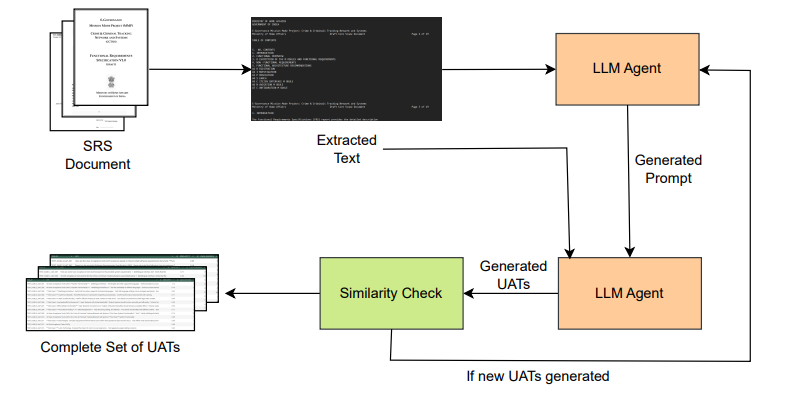

# 🧪 User Acceptance Test Case Generation Using LLMs

<div align="center">


**Automating UAT Generation from Software Requirements Specifications using Large Language Models**

*Punjab Engineering College (Deemed to be University), Chandigarh, India*

📄 [**Read the Paper**](https://doi.ieeecomputersociety.org/10.1109/CASCON66301.2025.00084) &nbsp;|&nbsp; ⭐ Star this repo to stay updated

</div>

---

## 📌 Overview

Manual User Acceptance Testing (UAT) is time-consuming, error-prone, and heavily dependent on human expertise. This work proposes an **automated, zero-shot LLM-based pipeline** that generates UAT cases directly from natural language Software Requirements Specification (SRS) documents — with no fine-tuning and no labeled examples required.

Five open-weight LLMs are benchmarked head-to-head on a public SRS dataset, evaluated across both **quantitative** and **qualitative** dimensions.

---

## ✨ Highlights

- 🚫 **Zero-Shot** — no training data, no domain adaptation, no human-in-the-loop
- 🔄 **Self-Optimizing Prompts** — a two-stage prompt engineering strategy where the LLM refines its own prompt before generating test cases
- 🔁 **Iterative Generation** — multi-cycle generation with early stopping and deduplication to maximize diversity
- 🤖 **LLM-as-a-Judge** — automated qualitative evaluation using Gemini 2.5 for Clarity, Testability, and Coverage scoring
- 📊 **Comprehensive Evaluation** — BERTScore, lexical similarity, word clouds, coverage heatmaps

---

## 🏗️ Pipeline



---

## 🤖 Models Evaluated

| Model | Developer | Parameters |
|---|---|---|
| **Gemma** | Google DeepMind | ~7B |
| **LLaMA 3** | Meta | ~8B |
| **Mistral** | Mistral AI | ~7B |
| **Phi** | Microsoft | ~3.8B |
| **Qwen** | Alibaba | ~7B |

All models run locally via **[Ollama](https://ollama.com/)** — no API keys or cloud credits needed.

---

## 📁 Dataset

**PURE** (Public Requirements) — 79 publicly available SRS documents in natural language, spanning multiple domains.

| Property | Value |
|---|---|
| Documents | 79 SRS PDFs |
| Source | [Zenodo](https://zenodo.org/record/1000975) |
| Format | Natural language PDF |
| Domains | Multiple (web, embedded, enterprise) |

---

## 📈 Key Results

### Quantitative Performance

| Model | Mean Similarity ↓ | Test Cases | Overall Score |
|---|---|---|---|
| **Gemma** | 0.41 | **1856** | **0.83** |
| LLaMA3 | 0.21 | 764 | 0.76 |
| Mistral | **0.16** | 612 | 0.74 |
| Phi | 0.25 | 543 | 0.68 |
| Qwen | 0.27 | 575 | 0.68 |

> Lower similarity = higher diversity. Overall score balances diversity, unique cycles, and volume.

### BERTScore (Semantic Similarity)

| Model | Precision | Recall | F1 |
|---|---|---|---|
| **Qwen** | **0.785** | **0.828** | **0.806** |
| Gemma | 0.777 | 0.827 | 0.801 |
| Phi | 0.747 | 0.814 | 0.779 |
| Mistral | 0.708 | 0.818 | 0.759 |
| LLaMA3 | 0.708 | 0.811 | 0.756 |

### Qualitative (LLM-as-a-Judge)

| Model | Best Cycle | Clarity (/ 5) | Testability (/ 5) |
|---|---|---|---|
| **LLaMA3** | 6 | 3.13 | **3.49** |
| Phi | 8 | **3.22** | 3.38 |
| Gemma | 7 | 2.87 | 3.08 |
| Qwen | 9 | 2.48 | 2.57 |
| Mistral | 2 | 2.58 | 2.44 |

---

## 🚀 Getting Started

### Prerequisites

```bash
Python >= 3.10
Ollama (for local LLM inference)
NVIDIA GPU recommended (tested on RTX 3090 Ti, 24GB VRAM)
```

### Installation

```bash
# Clone the repo
git clone https://github.com/your-username/UAT-LLM-Generation.git
cd UAT-LLM-Generation

# Install dependencies
pip install -r requirements.txt

# Pull models via Ollama
ollama pull gemma
ollama pull llama3
ollama pull mistral
ollama pull phi
ollama pull qwen
```

### Run

```bash
# Extract text from SRS PDFs
python extract_text.py --input_dir data/srs_pdfs/

# Generate UAT cases
python generate_uats.py --model llama3 --srs_dir data/extracted/

# Evaluate outputs
python evaluate.py --results_dir outputs/
```

---

## 📂 Repository Structure

```
UAT-LLM-Generation/
│
├── data/
│   ├── srs_pdfs/          # Place PURE dataset PDFs here
│   └── extracted/         # Auto-generated text extractions
│
├── src/
│   ├── extract_text.py    # PDF text extraction (PyPDF2)
│   ├── prompt_engine.py   # Two-stage prompt generation
│   ├── generate_uats.py   # Iterative UAT generation loop
│   └── evaluate.py        # BERTScore + similarity metrics
│
├── outputs/               # Generated UATs and evaluation results
├── requirements.txt
└── README.md
```

---

## 👥 Authors

| Name | Affiliation |
|---|---|
| **Siddhesh Varpe** | PEC Chandigarh |
| **Uttam Mittal** | PEC Chandigarh |
| **Rajesh Kumar Bhatia** | PEC Chandigarh |
| **Ashpreet** | PEC Chandigarh |

---

## 📄 Citation

If you use this work, please cite:

```bibtex
@INPROCEEDINGS{11344173,
  author    = {Varpe, Siddhesh and Mittal, Uttam and Bhatia, Rajesh Kumar and Ashpreet},
  booktitle = {2025 IEEE International Conference on Collaborative Advances in Software
               and COmputiNg (CASCON)},
  title     = {User Acceptance Test Case Generation Using LLMs},
  year      = {2025},
  pages     = {532--538},
  doi       = {10.1109/CASCON66301.2025.00084},
  publisher = {IEEE Computer Society},
  address   = {Los Alamitos, CA, USA},
  month     = Nov
}
```

---

## 🔗 Links

- 📄 [IEEE Paper](https://doi.ieeecomputersociety.org/10.1109/CASCON66301.2025.00084)
- 📦 [PURE Dataset on Zenodo](https://zenodo.org/record/1000975)
- 🤖 [Ollama](https://ollama.com/)

---

<div align="center">

If this work was useful to you, please consider giving it a ⭐

</div>
